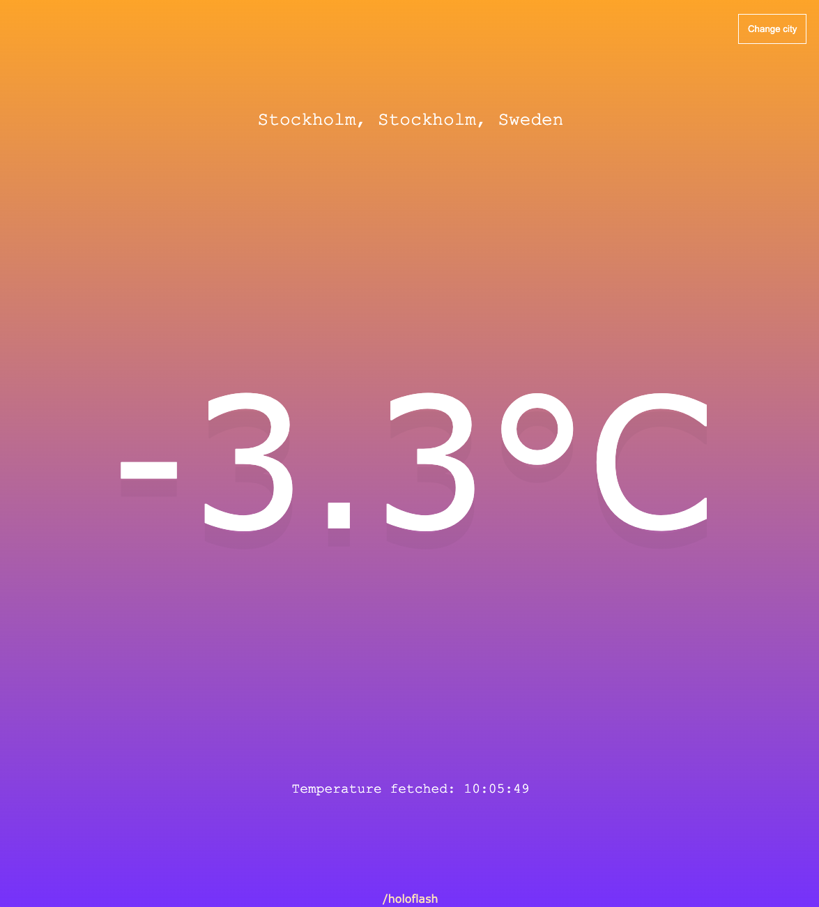

# Current Temperature

A simple weather app that displays the current temperature in any chosen city. Built as a student project while learning about API's.

-   Search for any city in the world
-   Display the city name, state, country and flag (if applicable) of the country for each search result
-   Toggle between celsius and fahrenheit by clicking on the temperature display
-   Once selected, display the full city name, the current temperature, and the temperature fetch time in local-time
-   Dynamic gradient background indicating the temperature (cold = blue, warm = red, night = dark-blue, day = orange)
-   Selected city and choose temperature unit (°C/°F) are stored in localStorage and displayed upon refresh/revisit of site
-   Reset localStorage via changeCity button

### Huge hanks to the amazing people behind these great API's used in this project:

-   [Open-Meteo](https://open-meteo.com/)
-   [Country Flags](https://www.countryflags.io/)

#### Technologies used:

